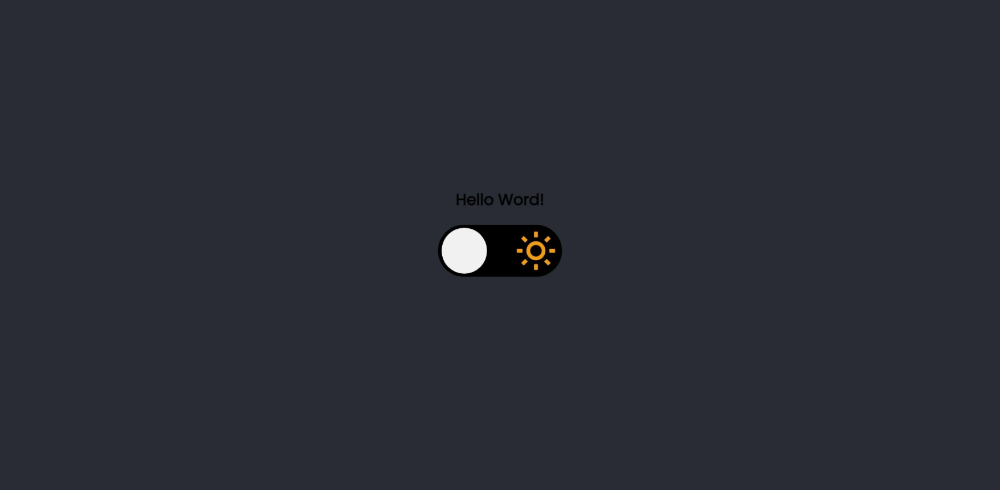
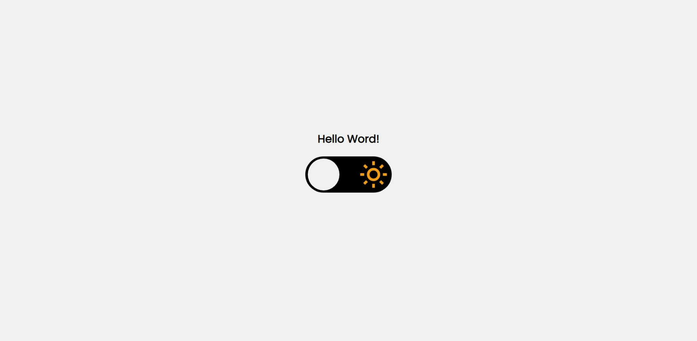

<h1 align="center"> Theme Switcher </h1>

    Esse projeto tem como objetivo desenvolver uma página que contém um toggle para alternar entre o tema dark e light

 

    
    

 

## 🚀 Tecnologias

Esse projeto foi desenvolvido com as seguintes tecnologias:

- HTML e CSS
- JavaScript

Você pode ver o projeto [clicando aqui](https://paulaandrezza.github.io/Theme-Switcher/).

 

## 🔖 Layout

Você pode visualizar o layout do projeto através [DESSE LINK]("https://www.figma.com/file/dO7o34Il8TV7XP6yoYFu8e/DD-%2F-Countdown-(Copy)?node-id=2001%3A2&t=zLawHsaRzJZ5DuEl-0/duplicate"). É necessário ter conta no [Figma](https://figma.com) para acessá-lo.